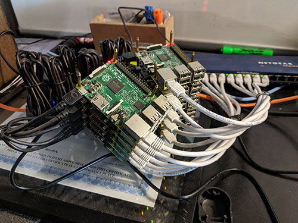

# rust-cross-pi
Rust code to be cross compiled from a Mac for running on a Raspi. Contains an LED blink demo (GPIO) and a fibonacci speed test.

## Install Cross Compiling Tools
- Install [rustup](https://rustup.rs/)
- Install [Docker](https://www.docker.com/get-started)
- Install Rust Targets
```
# Pi
rustup target add armv7-unknown-linux-gnueabihf
# Pi 0
rustup target add arm-unknown-linux-gnueabihf
```
- Clone [cross](https://github.com/rust-embedded/cross) and build
```
git clone git@github.com:rust-embedded/cross.git
cd cross
cargo build --release
```

## Compile Release for Pi from Mac
- Ensure Docker is **running**
- Run the build command
```
~/Projects/cross/target/release/cross build --release --target=armv7-unknown-linux-gnueabihf
```

## Run code on Pi stack at HeatSync
- Copy files to your Pi
```
scp target/armv7-unknown-linux-gnueabihf/release/rust-cross-pi pi@pinode6.local:/home/pi
```
- SSH into the Pi
```
ssh pi@pinode6.local
```
- If using LED Blink demo, simply run the command
```
./rust-cross-pi
```
- If using fibonacci speed test, run command with a number argument. This will be the seed for the fibonacci algorithm
```
./rust-cross-pi 30
```


